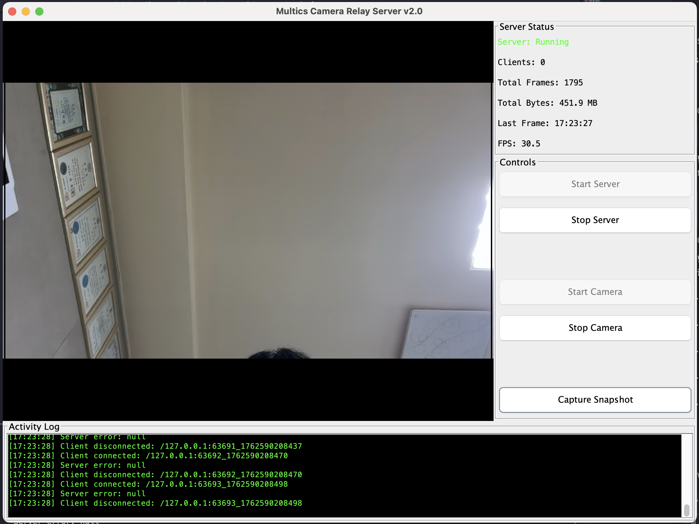
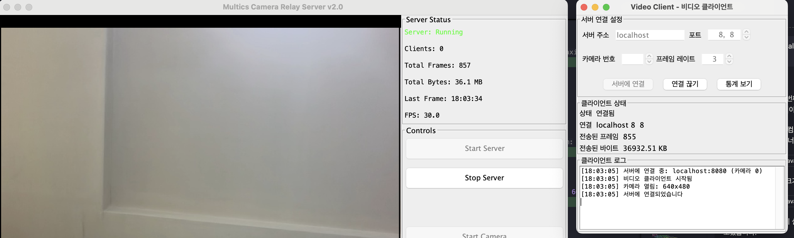

# Camera Relay Server

[](https://opencv.org/)
[](https://openjdk.java.net/)
[](https://maven.apache.org/)
[](LICENSE)

카메라 영상을 로컬 서버가 받아 중계하는 프로젝트입니다.  
OpenCV 기반 캡처 프로그램(`OpenCVCameraDemo`)이 영상 프레임을 수집하고, `VideoServerThread`가 TCP 스트림으로 전달받아 모니터링 패널에 렌더링하거나 향후 다른 모듈로 중계할 수 있도록 설계되었습니다.

## 📸 스크린샷

### 서버 메인 화면


### 클라이언트 연결 화면  


## 🚀 주요 기능

### 현재 구현된 기능
- **실시간 영상 스트리밍**: OpenCV 기반 카메라 캡처 및 TCP 전송
- **다중 클라이언트 지원**: 여러 클라이언트의 동시 연결 및 스트리밍
- **GUI 제어 인터페이스**: 서버 및 클라이언트용 사용자 친화적 인터페이스
- **한국어 현지화**: 완전한 한국어 UI 지원
- **실시간 통계**: 연결 상태, 프레임 수, 데이터 전송량 모니터링

### 🔮 개발 예정 기능
- **🎯 얼굴 인식**: OpenCV cascade 모델을 활용한 실시간 얼굴 검출 및 인식 기능 추가 예정
- **📊 인식 데이터 로깅**: 검출된 얼굴 정보의 데이터베이스 저장 및 분석
- **🔔 이벤트 알림**: 특정 얼굴 인식 시 알림 및 액션 트리거 시스템

## 구성 요소
- `com.multic.camera.OpenCVCameraDemo` (테스트 폴더) – 장치 카메라를 열어 프레임을 확인하고 필요 시 스냅샷을 저장합니다.
- `com.multic.server.VideoServerThread` – TCP 소켓을 개방해 외부/내부 클라이언트가 보낸 직렬화된 프레임을 수신하고, 안전하게 UI 스레드에서 출력합니다.
- `com.multic.server.ServerRunner` – 중계 서버 UI를 초기화하고 `VideoServerThread` 라이프사이클을 관리합니다.
- `com.multic.client.VideoClient` – 카메라에서 프레임을 캡처하여 서버로 전송하는 클라이언트 클래스입니다.
- `com.multic.client.VideoClientDemo` – 클라이언트를 GUI로 제어할 수 있는 데모 애플리케이션입니다.

## 실행 방법

### 환경 설정
macOS에서 카메라 권한 문제를 해결하기 위해 다음 환경 변수를 설정해야 합니다:
```bash
export OPENCV_AVFOUNDATION_SKIP_AUTH=1
```

### 실행 옵션

#### 서버 실행 (기본)
```bash
# 간편 스크립트 사용 (권장)
./run-server.sh

# 특정 포트 지정
./run-server.sh 8080

# Maven으로 직접 실행
mvn exec:java                    # 기본 포트 5252
mvn exec:java -Dexec.args="8080" # 포트 8080
```

#### 카메라 테스트 실행
```bash
# 간편 스크립트 사용 (권장)
./run-camera.sh

# Maven으로 직접 실행
mvn test-compile exec:java -Dexec.mainClass="com.multic.camera.OpenCVCameraDemo" -Dexec.classpathScope=test

# 수동 환경 변수 설정
export OPENCV_AVFOUNDATION_SKIP_AUTH=1
mvn test-compile exec:java -Dexec.mainClass="com.multic.camera.OpenCVCameraDemo" -Dexec.classpathScope=test
```

#### 클라이언트 실행
```bash
# 간편 스크립트 사용 (권장)
./run-client.sh

# Maven으로 직접 실행
mvn exec:java -Dexec.mainClass="com.multic.client.VideoClientDemo"
```

### 기능 설명

#### 카메라 캡처 (OpenCVCameraDemo)
- 카메라 영상을 실시간으로 표시
- `Capture` 버튼으로 이미지를 `images/` 폴더에 저장
- 테스트 목적으로 `src/test/java` 폴더에 위치

#### 중계 서버 (ServerRunner)
- TCP 소켓 서버로 비디오 프레임 수신
- 기본 포트: 5252
- GUI로 수신된 프레임 표시

#### 비디오 클라이언트 (VideoClientDemo)
- 카메라에서 실시간 프레임을 캡처하여 서버로 전송
- GUI를 통한 연결 관리 및 모니터링
- 실시간 통계 및 로그 표시
- 다양한 카메라 설정 지원 (프레임 레이트, 품질 등)

## 문제 해결

### OpenCV 관련 오류
1. **Java 버전 호환성**: OpenCV.loadShared()는 Java 12 이상에서 지원되지 않습니다. 자동으로 loadLocally()로 폴백됩니다.
2. **카메라 권한 오류**: macOS에서 `OPENCV_AVFOUNDATION_SKIP_AUTH=1` 환경 변수를 설정하면 해결됩니다.
3. **카메라 초기화 실패**: 다른 애플리케이션에서 카메라를 사용하고 있지 않은지 확인하세요.

### 실행 시 오류가 발생하는 경우
1. Java 버전 확인: Java 11 이상 필요
2. 카메라 연결 상태 확인
3. 시스템 권한 설정 확인 (macOS에서 터미널/IDE에 카메라 접근 권한 부여)

## 테스트
`VideoServerThreadTest`가 서버 스레드가 정상적으로 시작/종료되는지 검증합니다.  
```bash
mvn test
```

## 의존성
- OpenCV 4.7.0 (org.openpnp:opencv)
- JUnit 5.10.2 (테스트용)
- Java 11+

## 프로젝트 구조
```
src/
├── main/java/com/multic/
│   ├── server/                      # 서버 관련 클래스
│   │   ├── config/                  # 설정 관리
│   │   └── ui/                      # UI 컴포넌트
│   └── client/                      # 클라이언트 관련 클래스
└── test/java/com/multic/
    ├── camera/                      # 카메라 테스트 클래스
    ├── server/                      # 서버 테스트 클래스
    ├── client/                      # 클라이언트 테스트 클래스
    ├── integration/                 # 통합 테스트
    └── utils/                       # 테스트 유틸리티
```

향후 얼굴 인식(추가 모델은 `model/` 디렉터리 참고)과 다중 클라이언트 중계 기능을 확장할 수 있도록 구조를 단순화했습니다.

## 사용 예제

### 1. 서버-클라이언트 연동 테스트
1. 터미널 1에서 서버 실행:
   ```bash
   ./run-server.sh 8080
   ```

2. 터미널 2에서 클라이언트 실행:
   ```bash
   ./run-client.sh
   ```

3. 클라이언트 GUI에서:
   - Server Host: `localhost`
   - Port: `8080`
   - Camera Index: `0` (기본 카메라)
   - Frame Rate: `30`
   - `Connect` 버튼 클릭

### 2. 다중 클라이언트 연결
여러 클라이언트를 동시에 연결하여 멀티 스트리밍 테스트:
```bash
# 서버 실행
./run-server.sh 8080

# 클라이언트 1
./run-client.sh

# 클라이언트 2 (새 터미널에서)
./run-client.sh
```

### 3. 테스트 환경에서 검증
```bash
# 전체 테스트 실행
mvn test

# 특정 테스트만 실행
mvn test -Dtest=CameraServerIntegrationTest
mvn test -Dtest=VideoClientTest
```

---

## 📞 문의하기

**개발 관련 컨설팅 및 외주 받습니다.**

**프로젝트 관리자 연락처:**

- **Name**: 임현근 (Hyun-Keun Lim)
- **Email**: [hyun.lim@okkorea.net](mailto:hyun.lim@okkorea.net)
- **Homepage**: [https://www.okkorea.net](https://www.okkorea.net)

### 🛠️ 전문 분야

- **IoT 시스템 설계 및 개발**
- **임베디드 소프트웨어 개발** (Arduino, ESP32)
- **AI 서비스 개발** (LLM, MCP Agent)
- **클라우드 서비스 구축** (Google Cloud Platform)
- **하드웨어 프로토타이핑**

### 💼 서비스

- **기술 컨설팅**: IoT 프로젝트 기획 및 설계 자문
- **개발 외주**: 펌웨어부터 클라우드까지 Full-stack 개발
- **교육 서비스**: 임베디드/IoT 개발 교육 및 멘토링
